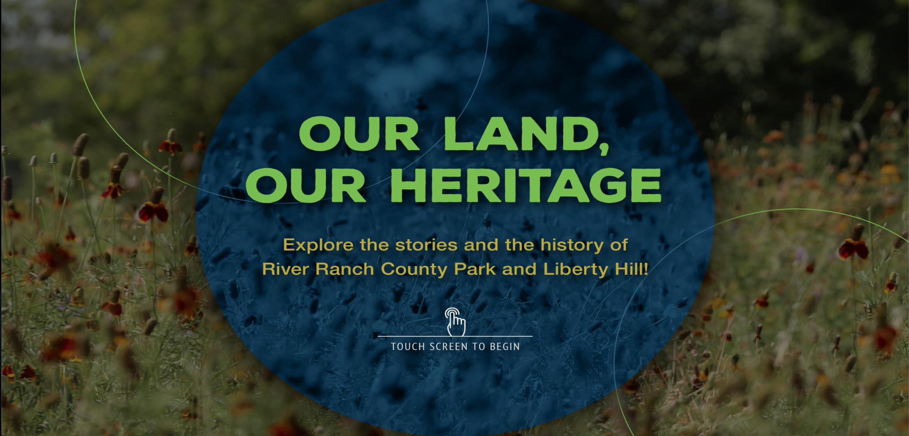

# River ranch



## Project Overview

This project is for a hands-on Museum exhibit kiosk that details the River ranch park.

## Setting up the project

## Install yarn

```shell
brew install yarn
```

## Install the dependencies

from within the root directory of the project run:

```shell
yarn install
```

## Configure chrome for audio

We have to setup our browser like this to allow sounds to playback without user interaction
<https://stackoverflow.com/questions/49930680/how-to-handle-uncaught-in-promise-domexception-play-failed-because-the-use>

## startup the project

yarn start

## Project structure

```javascript
/src/components: shared components can be reused across other projects
/src/containers: Container components are bound to route paths and images
The images for each page are stored under each /src/containers/img directory and paths are mapped through webpack
```

## Production build and server

```yarn build
yarn global add serve
serve -s build
```

## Setting up scheduled tasks on kiosk

Start up the Task Scheduler on Windows
Import the autostartBrowser.xml and autostartServer.xml
